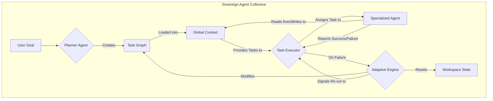

# Sovereign Agent Collective 👑

An autonomous, multi-agent framework designed to handle the entire software development lifecycle. This system acts as a virtual development agency, capable of planning, coding, testing, debugging, and learning from its experiences.

-----

## About The Project

The **Sovereign Agent Collective (SAC)** is not just a single coding agent; it's a collaborative team of specialized AI agents designed to tackle complex software engineering tasks with a high degree of autonomy.

What makes this project unique is its focus on **resilience**, **modularity**, and **self-improvement**.

  * 🧠 **Hierarchical Planning**: A dedicated **PlannerAgent** breaks down high-level goals into a detailed graph of dependent tasks.
  * 🤝 **Specialized Agents**: Each agent is an expert in its domain—from writing code and generating tests to analyzing security and clarifying user intent.
  * ⚙️ **Adaptive Engine**: When a task fails, the system doesn't just stop. A crisis manager reverts the project to a safe state and re-plans to navigate around the obstacle, enabling true **backtracking and recovery**.
  * 📚 **Global Context**: All agents operate on a shared "single source of truth," ensuring that every action is informed by the latest project state, artifacts, and history.
  * 🌱 **Learning Core**: After each mission, a dedicated learning component analyzes the entire workflow to extract successful patterns and failure heuristics, allowing the system to become smarter over time.

-----

## System Architecture

The system operates on a central orchestration loop that processes a **Task Graph**. This graph represents the complete project plan, with nodes as tasks and edges as dependencies. The **Orchestrator** executes tasks by assigning them to the appropriate specialized agent.



-----

## The Agent Roster: Your Autonomous Dev Team

| Agent / Component | Role | Responsibilities |
| :--- | :--- | :--- |
| **PlannerAgent** | The Engineering Manager | Creates and refines the high-level `TaskGraph` based on user goals and runtime feedback. |
| **IntentClarificationAgent** | The Business Analyst | Interacts with the user to resolve ambiguity and produce clear, actionable requirements. |
| **SpecGenerationAgent** | The Architect | Translates requirements into a detailed technical specification and system design. |
| **CodeManifestAgent** | The Tech Lead | Defines the file and directory structure for the project based on the technical spec. |
| **CodeGenerationAgent** | The Core Developer | Writes, modifies, and refactors application code according to the spec and assigned tasks. |
| **TestGenerationAgent** | The QA Engineer | Creates unit and integration tests to validate the generated code. |
| **TestRunnerAgent** | The QA Automation | Executes test suites and reports results, including failures and coverage metrics. |
| **ContextBuilderAgent** | The Researcher | Gathers and provides relevant code snippets and documentation for other agents to use. |
| **ToolingAgent** | The DevOps Specialist | Executes command-line tools for tasks like dependency installation, builds, and environment setup. |
| **DebuggingAgent** | The Troubleshooter | Analyzes errors, stack traces, and failed tests to identify root causes and suggest fixes. |
| **ChiefQualityOfficerAgent** | The QA & Security Lead | Performs static analysis, dependency audits, and security vulnerability scans to ensure code health. |
| **AdaptiveEngine** | The Crisis Manager | A system-level component that manages task failures by reverting state and triggering re-planning. |
| **InteractiveCollaboration** | The User Interface | A transparent window into the system, allowing the user to pause, inspect, and manually intervene. |
| **LearningCore** | The Optimization Engine | A background system that analyzes completed projects to find patterns and heuristics for improving future performance. |

-----

## Getting Started

To get the Sovereign Agent Collective running on your local machine, follow these simple steps.

### Prerequisites

  * Python 3.10+
  * Git installed on your system
  * An LLM API Key (e.g., from OpenAI, Google, or Anthropic)

### Installation

1.  **Clone the repository:**

    ```sh
    git clone https://github.com/your-username/sovereign-agent-collective.git
    cd sovereign-agent-collective
    ```

2.  **Create a virtual environment:**

    ```sh
    python -m venv venv
    source venv/bin/activate  # On Windows, use `venv\Scripts\activate`
    ```

3.  **Install the required packages:**

    ```sh
    pip install -r requirements.txt
    ```

4.  **Configure your LLM API Key:**
    You will need to configure your chosen LLM client in the placeholder `LLMClient` classes within the `agents` directory. This typically involves setting an environment variable:

    ```sh
    export OPENAI_API_KEY='your-api-key-here'
    ```

-----

## Usage

To start a mission, run `main.py` from your terminal and provide the high-level goal as an argument.

### Example

```sh
python main.py "Build a simple Flask REST API for user registration and login that uses JWT for authentication."
```

You can also specify a custom directory for the project workspace:

```sh
python main.py "Create a Python script that scrapes headlines from a news website." --workspace ./scrapers
```

The agent will then begin its work, and you will see real-time status updates in your terminal.

-----

## How It Works: A Mission Walkthrough

Here’s a step-by-step example of how the agent collective handles a mission.

**Goal**: `"Build a user auth API."`

1.  **Planning**: The `Orchestrator` starts and invokes the `PlannerAgent`. The planner analyzes the goal and creates a `TaskGraph` with several dependent tasks: `Clarify Intent` -\> `Generate Spec` -\> `Generate Manifest` -\> `Generate Code` -\> `Generate Tests` -\> `Run Tests`.

2.  **Clarification**: The `IntentClarificationAgent` is executed. It uses an LLM to identify ambiguities in the goal and asks the user questions via the terminal:

    > **ACTION REQUIRED**
    > The agent needs your input to proceed:

    > > What authentication mechanism should be used (e.g., JWT, OAuth2, session cookies)?

    > Your response: **JWT**

3.  **Architecture**: The `SpecGenerationAgent` and `CodeManifestAgent` run in sequence, producing `technical_spec.md` and `file_manifest.json` artifacts.

4.  **Development**: The `CodeGenerationAgent` reads the spec and manifest and writes the necessary Python files (`models.py`, `routes.py`, etc.) to the workspace. Each file write is a separate Git commit, tagged with the task ID.

5.  **Testing**: The `TestGenerationAgent` writes `tests/test_auth.py`. The `PlannerAgent` then adds a task for the `ToolingAgent` to run `pytest --json-report`. Finally, the `TestRunnerAgent` is tasked with analyzing the JSON report.

### Failure and Recovery Scenario

6.  **A Test Fails**: The `TestRunnerAgent` analyzes the report and finds a failed test. It returns a `failure` status to the `Orchestrator`.

7.  **Adaptive Engine Triggered**: The `Orchestrator` invokes the `AdaptiveEngine`.

      * The engine analyzes the failure: a `TypeError` in the password hashing logic.
      * It uses Git to **revert the commits** made by the `CodeGenerationAgent` and `TestGenerationAgent`, returning the workspace to a clean state.
      * It marks the failed task and all its downstream dependencies as "obsolete."
      * It invokes the `PlannerAgent` with a new, high-priority goal: `"The plan failed during testing due to a TypeError in password hashing. Create a recovery plan."`

8.  **Re-Planning**: The `PlannerAgent` creates a new sub-plan: `Debug Failure` -\> `Apply Fix` -\> `Re-run Tests`.

9.  **Recovery**: The `DebuggingAgent` analyzes the code and the error to produce a `suggested_fix.diff`. The `CodeGenerationAgent` applies this patch, and the tests are run again. This time, they pass, and the mission continues to a successful conclusion.

-----

## Testing

The project includes a comprehensive suite of unit tests. Each module in the `core` and `agents` directories contains its own self-testing block.

To run the tests for a specific module, execute it as a script:

```sh
python core/models.py
python agents/planner.py
python orchestrator.py
```

This ensures that you can verify the functionality of each component in isolation before running the full system.